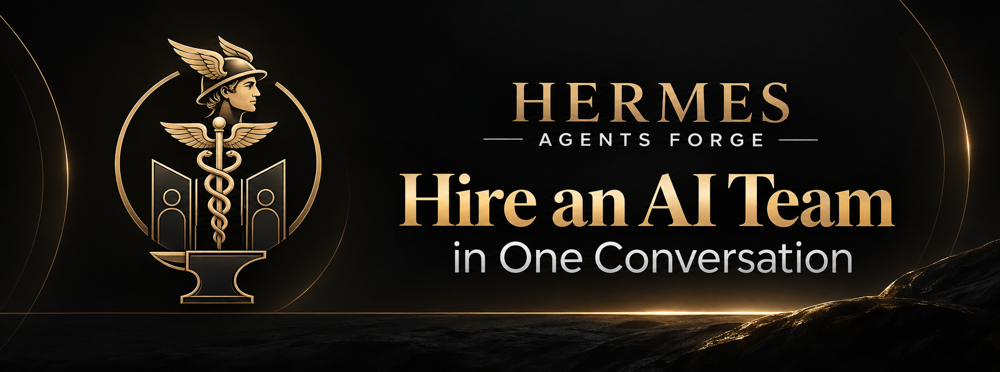

# Hermes Agents Forge

**Agent-directed onboarding for autonomous AI teams**

Repo: https://github.com/juliench82/hermes-agents-forge
Live instructions: https://hermes-agents-forge.vercel.app/llms.txt

---

## What this repo is

Hermes Agents Forge is a self-contained, agent-directed onboarding system. The
methodology is the same everywhere: your agent reads one plain-text operating
manual, interviews you, designs a team of specialists, asks for one explicit
approval, provisions it, verifies it, and hands off a first task.

**No installation. No cloning. No configuration. The agent is the installer.**

This repository now ships that methodology for three platforms. Each one is
self-contained — read only its own `llms.txt`, and ignore the others.

| Platform | Entry point | What you get |
|---|---|---|
| **HERMES** | `hermes/llms.txt` | Isolated bot-mode profiles with `SOUL.md` personas, wired as an autonomous work force |
| **Claude** | `claude/llms.txt` | Claude Desktop Chat skills, packaged as ready-to-upload ZIPs |
| **Codex** | `codex/llms.txt` | Codex `.clmd` skills installed to `~/.codex/skills/` |

---

## The shared methodology

Every platform follows the same six steps:

1. **Interview** — defaults first, then one question. On **HERMES** the agent presents the
   default design in one short plain-language summary and asks a single question — *"Is there
   any specific non-default case for you?"* The **Claude** and **Codex** packages use a
   5-question interview instead (goals, tools, quality bar, complexity, exclusions). Check the
   `llms.txt` you are pointing your agent at before assuming which one applies.
2. **Select a tier** — 3 / 5 / 7 specialists, by complexity. Never 4 or 6.
3. **Propose the team** — names, roles, responsibilities, tools, boundaries.
4. **One approval** — a single explicit yes covers the whole plan.
5. **Provision** — create real personas and real skills on that platform.
6. **Verify** — receipts before any "done" claim. Never a false completion.

---

## HERMES

Full documentation: **[`hermes/README.md`](hermes/README.md)**
Operating manual: **[`hermes/llms.txt`](hermes/llms.txt)** (also served live at the URL above)

```text
Read and follow the agent instructions at https://hermes-agents-forge.vercel.app/llms.txt
```

Provisions isolated Hermes profiles, rich `SOUL.md` personas against the 10-section
schema, real installed skills, an autonomy chain, and typed decision cards routed
through a single decision bot.

```text
hermes/
├── llms.txt              # operating manual (agent-facing)
├── README.md             # end-user quickstart
├── HERMES.md             # Forge concepts → Hermes primitives mapping
├── skills/
│   ├── forge/            # Team Setup procedure
│   └── workflow-builder/ # separate workflow phase
└── catalog/
    ├── skills.json
    └── roles/
        ├── soul-schema.md
        └── examples/
```

---

## Claude

Full documentation: **[`claude/README.md`](claude/README.md)**
Operating manual: **[`claude/llms.txt`](claude/llms.txt)**

```text
Read and follow the agent instructions at claude/llms.txt
```

Generates Claude Desktop Chat skills. Each skill is a `SKILL.md` with a persona
block in its frontmatter — the Claude equivalent of a Hermes `SOUL.md` — packaged
as a ZIP for upload via `Settings → Capabilities → Skills → Add Skill`.

```text
claude/
├── llms.txt              # operating manual (agent-facing)
├── templates/            # persona schema + standard SKILL.md template
├── skills/<name>/        # 7 pre-built skills
├── packages/*.zip        # ready to upload
├── builders/             # validate + package + registry
└── docs/pipeline.md      # how the 7 skills chain together
```

**Pre-built skills:** `market-scout`, `idea-challenger`, `decision-bot`,
`product-manager`, `product-architect`, `mvp-builder`, `quality-guardian`.

---

## Codex

Full documentation: **[`codex/README.md`](codex/README.md)**
Operating manual: **[`codex/llms.txt`](codex/llms.txt)**

```text
Read and follow the agent instructions at codex/llms.txt
```

Generates Codex skills as `.clmd` files — markdown with the same persona
frontmatter — installed into `~/.codex/skills/`.

```text
codex/
├── llms.txt              # operating manual (agent-facing)
├── templates/            # persona schema + standard .clmd template
├── skills/*.clmd         # 7 pre-built skills
├── builders/             # generate + install
└── docs/development.md   # create, test, install
```

**Install the pre-built skills:**

```bash
python3 codex/builders/install_skills.py
```

---

## Why one repo

The methodology is platform-agnostic. What changes per platform is only the
delivery mechanism:

| | Hermes | Claude | Codex |
|---|---|---|---|
| Persona container | `SOUL.md` per profile | `persona:` block in `SKILL.md` | `persona:` block in `.clmd` |
| Distribution | Hermes CLI | ZIP upload via UI | filesystem copy |
| Team shape | autonomous work force + dispatcher | sequential skill chain | sequential skill chain |

Keeping them together makes the shared methodology reviewable in one place and
lets each platform's instructions be diffed against the others.

---

## Repository layout

```text
/
├── README.md        # this file — multi-platform front door
├── PRODUCT.md       # product requirements
├── CHANGELOG.md
├── LICENSE
├── site/            # deployed to Vercel (site + live llms.txt)
├── hermes/          # Hermes platform instructions
├── claude/          # Claude platform instructions
└── codex/           # Codex platform instructions
```

---

## Links

- Repo: https://github.com/juliench82/hermes-agents-forge
- Live HERMES instructions: https://hermes-agents-forge.vercel.app/llms.txt
- HERMES docs: https://hermes-agent.nousresearch.com/docs